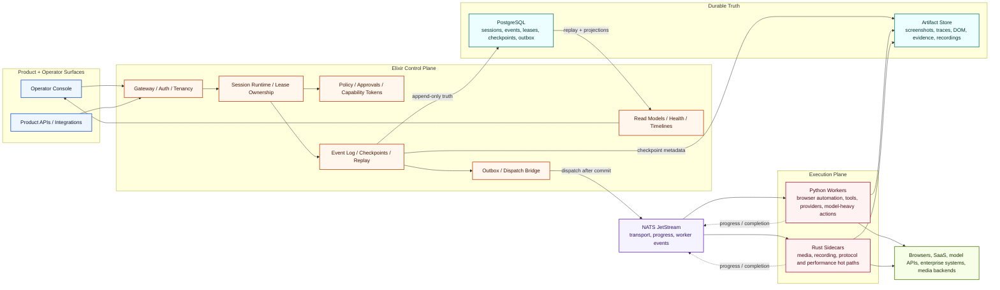

# Aegis Runtime

[](https://github.com/aliuyar1234/Aegis/actions/workflows/runtime-suites.yml)
[](https://github.com/aliuyar1234/Aegis/actions/workflows/contracts-validate.yml)
[](https://github.com/aliuyar1234/Aegis/actions/workflows/docs-validate.yml)
[](https://github.com/aliuyar1234/Aegis/actions/workflows/phase-gates.yml)

**Aegis Runtime** is a BEAM-native control plane for long-lived AI sessions.
It is built for teams that need more than prompt orchestration: durable ownership, replayable timelines, policy enforcement, human approvals, operator intervention, browser-backed execution, and credible recovery after failure.

Instead of treating an AI system like a sequence of stateless requests, Aegis treats each session as a supervised, recoverable runtime object with durable history.

> Durable AI sessions, not best-effort agent loops.

Built around Elixir, PostgreSQL, NATS JetStream, Python workers, and Rust sidecars.

## System Architecture



## Session Lifecycle

```mermaid
flowchart LR
    classDef entry fill:#eff6ff,stroke:#2563eb,stroke-width:1.4px,color:#0f172a;
    classDef control fill:#fff7ed,stroke:#c2410c,stroke-width:1.4px,color:#431407;
    classDef durable fill:#ecfeff,stroke:#0f766e,stroke-width:1.4px,color:#042f2e;
    classDef worker fill:#fdf2f8,stroke:#be185d,stroke-width:1.4px,color:#500724;
    classDef output fill:#f7fee7,stroke:#4d7c0f,stroke-width:1.4px,color:#1a2e05;

    IN["User, API, or Operator action"]:::entry
    OWN["Authoritative session owner"]:::control
    POL["Policy and approval evaluation"]:::control
    EVT["Append event + checkpoint intent + outbox"]:::durable
    DSP["Dispatch through transport"]:::control
    WRK["Python worker or Rust sidecar executes"]:::worker
    ART["Artifacts, progress, completion, uncertainty"]:::output
    RPL["Replay, projections, operator timeline"]:::durable

    IN --> OWN
    OWN --> POL
    POL --> EVT
    EVT --> DSP
    DSP --> WRK
    WRK --> ART
    ART --> OWN
    EVT --> RPL
    ART --> RPL
```



## Why Aegis Exists

Most agent stacks still break at the runtime boundary.
They can call a model, open a browser, or trigger a workflow, but they struggle when the real-world problems begin:

- a browser flow partially succeeds and then crashes
- a dangerous action needs approval before dispatch
- ownership is lost after a node failure
- an operator needs to inspect, pause, or take over a live session
- artifacts, checkpoints, and timelines must remain trustworthy
- multiple workers and transports exist, but only one system is allowed to own truth

Aegis is the runtime layer for those problems.

## The Core Idea

The central abstraction is the **session**, not the request, chat turn, job, or queue message.

That decision drives the whole architecture:

- **Elixir owns authority** for runtime state, orchestration, leases, replay, approvals, and operator surfaces.
- **PostgreSQL is the source of truth** for the timeline, checkpoints, leases, and dispatch intent.
- **JetStream is transport, not truth** for cross-language execution.
- **Python and Rust execute work** without becoming the canonical state owner.
- **Artifacts live off the event stream** while the control plane keeps metadata and references.

The result is a system designed for recovery, auditability, and operational confidence instead of demo-only automation.

## What Makes This Architecture Different

- **Single authoritative owner per session** keeps runtime decisions coherent under concurrency and failure.
- **Append-only event timelines** make replay, audit, and projection rebuilds a first-class capability.
- **Committed intent before side effects** prevents the execution plane from freelancing around durable state.
- **Policy and approvals are runtime primitives** rather than optional product-layer add-ons.
- **Operator intervention is built into the model** through views, notes, takeover, pause, return-to-automation, and replay.
- **Cross-language boundaries are explicit** so Elixir, Python, and Rust each do the work they are best at without collapsing the architecture.

## Design Principles

- **Control plane first** so orchestration, durability, and policy remain stable even when execution workers fail.
- **Failure is part of the model** through leases, fencing, checkpoints, replay, uncertainty classification, and operator takeover.
- **Operational visibility is mandatory** through timelines, artifacts, projections, runbooks, and health surfaces.
- **Heterogeneous execution is intentional** because browser work, provider integrations, and media paths do not belong in one runtime.

## Technology Split

- **Elixir / BEAM**
  Durable session orchestration, leases, policy, approvals, replay, projections, operator console, and supervisory behavior under failure.
- **Python**
  Browser automation, tool execution, provider integrations, structured execution workers, and model-heavy actions.
- **Rust**
  Media, recording, protocol bridges, and other hot-path or binary-heavy components where isolation and performance matter.

## Repository Tour

- [Product definition](docs/overview/product.md)
- [Architecture overview](docs/overview/architecture.md)
- [Documentation index](docs/README.md)
- [Repository map](docs/overview/repo-map.md)
- [Design documents](docs/design-docs/)
- [Runbooks](docs/runbooks/)
- [Threat models](docs/threat-models/)
- [Schemas and contracts](schema/)

## What You Will Find In This Repo

- An Elixir umbrella application for the control plane
- Python packages for browser and execution-plane workers
- Rust sidecar surfaces for future media and protocol-heavy paths
- Event, checkpoint, artifact, and policy contracts under `schema/`
- Runbooks, design docs, and operational guidance under `docs/`
- Validation, generation, and test tooling under `scripts/` and `tests/`

## Getting Started

If you want the fastest orientation path:

1. Read [Product definition](docs/overview/product.md)
2. Read [Architecture overview](docs/overview/architecture.md)
3. Read [Repository map](docs/overview/repo-map.md)
4. Browse [design docs](docs/design-docs/) for the subsystem you care about

If you want to work on the codebase itself:

1. Read [AGENTS.md](AGENTS.md)
2. Run `make bootstrap`
3. Run `make validate`
4. Use [test strategy](docs/overview/test-strategy.md) as the correctness contract

## Validation

```bash
make bootstrap
make validate
make ci
```

## Documentation

- [Docs index](docs/README.md)
- [ADR log](docs/adr/)
- [Product specs](docs/product-specs/)
- [Reference docs](docs/references/)
